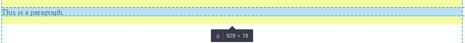

<p align="center">
  
</p>

<h3 align="center">HTML Tutorial</h3>

<p align="center">HTML dilinde en çok sık kullanılan etiketler ve örnekler ile desteklenen bir proje çalışmasıdır.</p>

<div align="center" id="links">
  <span align="center"><strong><a href="https://developer.mozilla.org/en-US/docs/Web/HTML" target="_blank">MDN</a></strong></span>
  <span align="center"><strong><a href="https://www.w3schools.com/" target="_blank">W3Schools</a></strong></span>
</div>

## HTML Hakkında

<p>HTML dili açılım olarak Hyper Text Markup Language olarak olup, bir yazılım dili olmamakla beraber web sayfalarını oluşturulmak için kullanılan bir metin işaretleme dilidir ve en güncel sürümü <strong>HTML5</strong> sürümüdür.</p>

## Öğrenim içeriği

<p>Listeler üzerinde yer alan içeriklerin üzerine tıklayarak ilgili sayfa menüsüne ulaşabilirsiniz. Ek olarak ilgili içerik üzerinden örnek html dosyalarına ulaşabilirsiniz.</p>

<ul>
  <li><a href="#temel-html">Temel HTML etiketlerine genel bakış</a></li>
    <ul>
      <li><a href="#yazim-html">Yazım HTML etiketleri</a></li>
      <li><a href="#resim-html">Resim HTML etiketleri</a></li>
      <li><a href="#br-hr-html">Breakline (br) ve (hr) etiketleri</a></li>
      <li><a href="#header-html">HTML Header ve Metatag yapıları</a></li>
    </ul>
  <li><a href="#semantic-html">Semantic HTML etiketleri</a></li>
  <li><a href="#block-inline-html">Blok ve inline elementler</a></li>
  <li>Liste etiketleri</li>
  <li>VS Code Emmet Kullanımı</li>
  <li>Tablo yapıları</li>
  <li>Form yapıları</li>
</ul>

<h3 id="temel-html">Temel HTML Etiketleri</h3>
<hr>
<p>Bir web sayfası üzerinde sadece <strong>html</strong> etiketi yer almaz bunun haricinde <em>header,body</em> gibi etiketlerde yer almaktadır. 
<strong>html</strong> etiketi HTML dilinin root (temel) etiketi denebilir. Diğer etiketler <strong>html</strong> etiketinin içinde yer alan etiketlerdir.

İşaretleme sıraları aşağıdaki gibidir.</p>
  
 ├── html <br>
     &nbsp;  ├── <a href="#header-html">header</a> <br>
     &nbsp;  ├── <a href="#body">body</a>
     
<h3 id="header-html">Header Etiketi</h3>

<p>Web sitemizde özellike SEO ayarları veya sitenin metatagleri için kullanabileceğimiz alanı oluşturmaktadır. Burada girilen kodlar veya etiketler sitemiz içerisinde yer alan fakat görsellik anlamında bir değişiklik yapmazlar.</p>

<p>Metatag etiketleri sayı olarak biraz fazla olup genel bir HTML sayfasında genel olarak aşağıdaki Metatagler sık sık kullanılmaktadır.</p>

<p>Metatagleri kullanılırken aşağıdaki söz dizimi ile kullanılmaktadır.</p>

```md
<meta name="">
```

<table>
<thead>
  <td><strong>Metatag Etiketi</strong></td>
  <td><strong>Açıklama</strong></td>
</thead>
<tbody>
  <tr>
    <td>name="description"</td>
    <td>Arama motorlarında çıkan sonuçlarında sitelerin açıklaması olarak gözükmektedir.</td>
  </tr>
  <tr>
    <td>name="keywords"</td>
    <td>Arama motorları sorgulamaların sitelerin indexlenmesinde anahtar kelimelerini belirlemektedir.</td>
  </tr>
  <tr>
    <td>charset="UTF-8"</td>
    <td>Web sitesini emoji ve türkçe karaktere uygun olacak şekilde (utf-8) olarak kodlar.</td>
  </tr>
</tbody>
</table>

<h3 id="body">Body Etiketi</h3>

<p>Body etiketi ise sitemizde yer alan tüm içerikleri, görselleri, makaleleri vb. kısacası tüm içeriklerimizin yer aldığı etiket olarak yer almaktadır.</p>

```md
<body>
  <h1>The p element</h1>
  <p>This is a paragraph.</p>
  <p>This is a paragraph.</p>
  <p>This is a paragraph.</p>
</body>
```

<h3 id="yazim-html">Yazım HTML Etiketleri</h3>
<hr>

<h4>Strong Etiketi</h4>
<p>HTML üzerinde oluşturduğumuz metin veya parargrafları tüm kelimelerini veya belirli kelimeleri <strong>kalın</strong> yapabileceğimiz bir HTML etikedir. Kullanımı aşağıdaki gibidir.</p>

```md
<body>
<p>Bu bir <strong>strong (bold)</strong> bir metindir.</p>
</body>
```

<h4>Em Etiketi</h4>
<p>HTML üzerinde oluşturduğumuz metin veya parargrafları tüm kelimelerini veya belirli kelimeleri <em>italik</em> yapabileceğimiz bir HTML etikedir. Kullanımı aşağıdaki gibidir.</p>

```md
<body>
<p>Bu bir <em>em (italik)</em> bir metindir.</p>
</body>
```

<h3 id="resim-html">Resim Etiketleri</h3>
<hr>

<p>HTML üzerinde yazım ve paragraf dışında resimleri ekleyebileceğimiz metotlarda mevcut olup, aşağıdaki şekilde kullanılmaktadır.</p>

```md
<body>

<!-- Burada yer alt etiketi resmin yüklenemediği zaman resmin açıklaması olarak yazan bir metindir. -->
</body>
```


<h3 id="br-hr-html">Breakline ve HR Etiketleri</h3>
<hr>

<p>br ve hr etiketleri yeni bir satıra geçerken veya yeni bir satıra çizgi bir satır oluşturuken kullanabileceğimiz etiketlerdir denebilir.</p>

```md
<body>
<p>Enes Akkaya</p>
<br>
<p>enesakkayapr@gmail.com</p>
<hr>
<p>linkedin.com/enesakkaya</p>
</body>
```
<p><strong>İsim Soyisim: </strong>Enes Akkaya</p>
<p><strong>Mail Adresi: </strong>enesakkayapr@gmail.com</p>
<hr>

<h3 id="semantic-html">Semantic HTML Etiketleri</h3>
<hr>

<p>HTML yapılarında hem kodlama açısından hemde SEO optimizasyonu açısında MDN tarafından detaylı ele alınmış semantic HTML etiketler bulunmaktadır. Aşağıda sık olarak kullanılan semantic etiketler yer almaktadır.</p>

<table>
  <thead>
    <tr>
      <td>Etiket</td>
      <td style="text-align:center">Açıklama</td>
    </tr>
  </thead>
  <tbody>
    <tr>
      <td>Main</td>
      <td>Sayfa içerisinde ana içeriği vurgulamak için kullanılan etiketdir, ve SEO optimizasyonu açısından sadece bir defa kullanılmaktadır.</td>
    </tr>
     <tr>
      <td>Header</td>
      <td>İsminden de anlaşılacağı üzere sitemizde yer alan bölümlerin en üst sayfa başlığının yer aldığı bölümlerde kullanılmaktadır.</td>
    </tr>
    <tr>
      <td>Nav</td>
      <td>Kısaltması Navbar olarak yer alan semantic etiket olarak geçmektedir, genellikle menü yapılarında kullanılmaktadır.</td>
    </tr>
    <tr>
      <td>Section</td>
      <td>Section etiketi genel bir etiket olup sitemiz içerisinden yer alan (div etiketleri gibi) yapıları bölüm bölüm ayırabileceğimiz yapılarda kullanılmaktadır.        </td>
    </tr>
    <tr>
      <td>Article</td>
      <td>Sitemiz içerisinde yer alan özellikle makale tarzı içeriklerde article etiketi kullanılmaktadır.</td>
    </tr>
    <tr>
      <td>Footer</td>
      <td>Header etiketinde olduğu gibi sitemizin alt menüsünü için kullanılan yapılarda kullanılmaktadır.</td>
    </tr>
  </tbody>
</table>

<h3 id="block-inline-html">Block ve Inline Etiketler</h3>
<hr>

<p>HTML yapılarında kullanırken block veya inline element etiketleri mevcuttur ve hepsini kendisine ait kullanımları mevcuttur. Özellikle sık olarak kullanılan inline ve block elementlere bakacağız.</p>

<p>Detaylı kaynak açıklama makalesi: <a href="https://developer.mozilla.org/en-US/docs/Web/HTML/Inline_elements" target="_blank">MDN</a></p>

<h4>Block Elementler</h4>
  <ul>
    <li>div etiketi</li>
    <li>p etiketi</li>
    <li>h1-h6 etiketleri</li>
  </ul>
  
 <h4>Inline Elementler</h4>
  <ul>
    <li>span etiketi</li>
    <li>strong ve em etiketleri</li>
  </ul>
  
<h4>Inline Element</h4>
<p>Inline elementler sadece kaplandığı alan kadar yer kaplarlar. Block elementlere nazaran tüm satırları değil, sadece yazıldığı alan kadar yer kaplamaktadır. Aşağıdaki örnekte gözüktüğü gibi</p>


<h4>Block Element</h4>
<p>block elementler ise bulunduğu alan değil tüm satırı kaplar ve bir sonraki satıra geçiş yapmaktadır. Inline arasındaki en temel fark ise budur.</p>




<h3 id="liste-etiketleri-html">Liste Etiketleri</h3>
<hr>

<p>HTML yapılarında iki tür liste kullanımı bulunmaktadır. Özellikle menü yapılarında kullanılmaktadır. Sıralı ve sırasız olmak üzere iki çeşit liste bulunmaktadır.</p>

<h4>Sıralı Listeler</h4>
